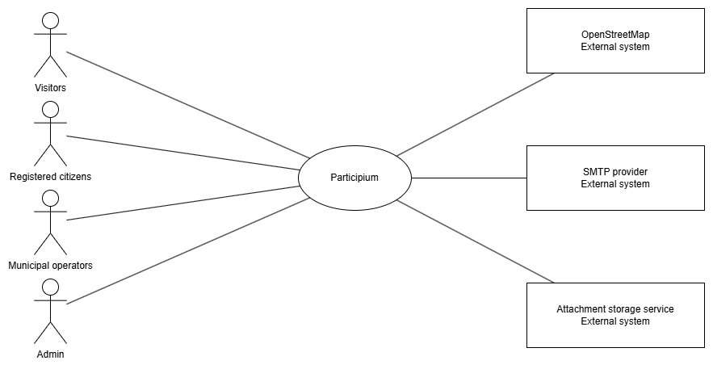
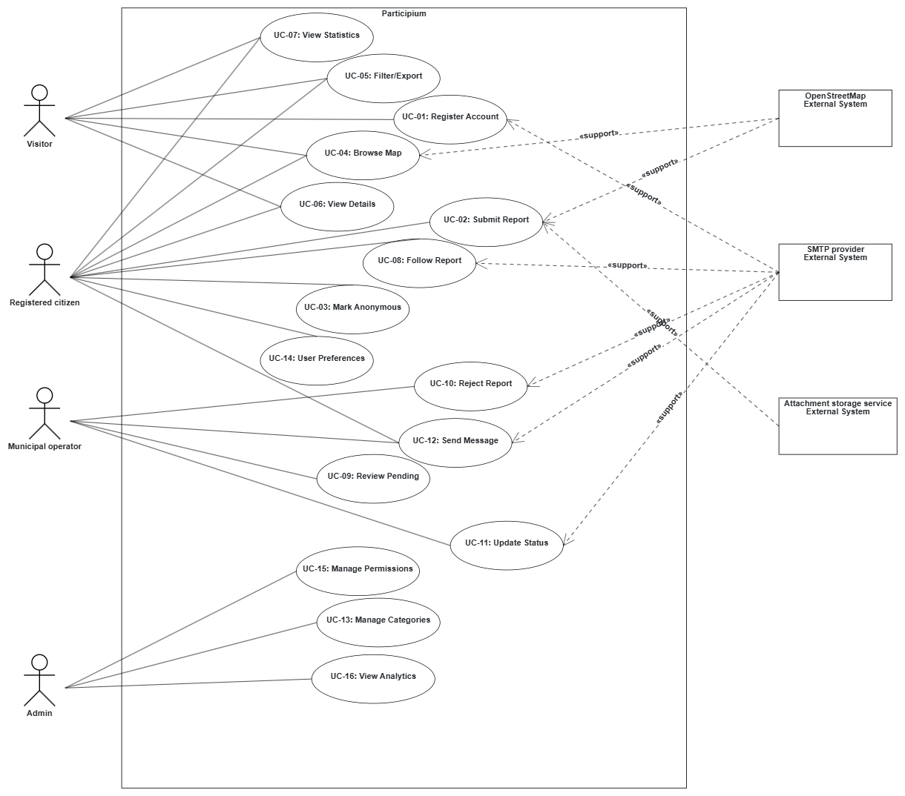

# Participium

Participium is a full-stack civic-participation platform for reporting and managing urban issues.

Citizens can submit geo-located reports with photos, categories, and descriptions; municipal operators can review and manage reports assigned to their area of responsibility; and administrators can manage users and oversee the platform. The application also provides public report views, status tracking, notifications, direct messaging, and interactive API documentation.

> **Portfolio version**  
> This repository is a cleaned portfolio copy of a collaborative Software Engineering project. Course task sheets, grading material, student information, private environment files, local databases, and other internal artifacts are intentionally excluded.

---

## Features

### Citizen

- Register, verify an account, sign in, and manage profile preferences
- Create reports with a title, description, category, location, and photos
- Select report locations using an interactive Leaflet/OpenStreetMap map
- Submit reports anonymously when desired
- Track report status and history
- Receive in-platform notifications
- Exchange messages with the municipal operator handling a report

### Municipal Operator

- View pending reports belonging to the operator's assigned category
- Assign reports and manage their lifecycle
- Update report status
- Communicate directly with citizens
- Track assigned reports and ongoing work

### Administrator

- Access administration workflows
- Manage platform users and roles
- Oversee reports and platform activity

### Public Platform

- Browse public reports
- View reports on a map or in a table
- Filter and sort published information
- Inspect report details and current status

---

## Report Workflow

Reports move through a controlled lifecycle such as:

```text
Pending Approval
      |
      v
   Assigned
      |
      v
 In Progress
   /      \
Resolved  Suspended
```

Reports may also be rejected during review. Available actions depend on the authenticated user's role and the report's current state.

---

## Tech Stack

| Layer | Technologies |
|---|---|
| Frontend | React 19, TypeScript, Vite, React Router |
| Maps | Leaflet, OpenStreetMap |
| Backend | Python, Flask, SQLAlchemy |
| API | REST, Swagger / OpenAPI |
| Local Database | SQLite |
| Docker Database | MySQL 8 |
| Testing | pytest, Selenium |
| Infrastructure | Docker, Docker Compose |

---

## Architecture

The backend follows a layered architecture that separates transport, application logic, business rules, and persistence:

```text
HTTP Routes
    |
Controllers
    |
Services
    |
Repositories
    |
SQLAlchemy Models
    |
Database
```

The frontend is implemented as a React single-page application with:

- a dedicated API layer
- authentication context
- protected routes
- reusable components
- role-specific pages

Architecture diagrams are available in [`docs/architecture`](docs/architecture/).

### Context Diagram



### Use-Case Diagram



Additional diagrams include:

- Class Diagram
- Deployment Diagram

---

## Repository Structure

```text
participium/
├── README.md
├── .gitignore
├── .dockerignore
├── docker/
│   ├── backend.Dockerfile
│   ├── frontend.Dockerfile
│   └── docker-compose.yml
├── docs/
│   └── architecture/
│       ├── context-diagram.png
│       ├── use-case-diagram.png
│       ├── class-diagram.png
│       └── deployment-diagram.png
└── src/
    ├── backend/
    │   ├── participium/
    │   ├── tests/
    │   ├── .env.example
    │   ├── requirements.txt
    │   └── wsgi.py
    └── frontend/
        ├── src/
        ├── tests/
        ├── .env.example
        ├── package.json
        └── vite.config.ts
```

---

# Build and Run Locally

## Prerequisites

For the manual setup, install:

- **Python 3.12**
- **Node.js and npm**
- **Git**

Docker users can alternatively use Docker Desktop or Docker Engine with Docker Compose.

---

## 1. Clone the Repository

```bash
git clone <YOUR-GITHUB-REPOSITORY-URL>
cd participium
```

Replace `<YOUR-GITHUB-REPOSITORY-URL>` with the repository URL after publishing it.

---

## 2. Start the Backend

### Windows PowerShell

```powershell
cd src\backend
python -m venv .venv
.\.venv\Scripts\Activate.ps1
python -m pip install -r requirements.txt
Copy-Item .env.example .env
python wsgi.py
```

### Linux / macOS

```bash
cd src/backend
python3 -m venv .venv
source .venv/bin/activate
python -m pip install -r requirements.txt
cp .env.example .env
python wsgi.py
```

The backend starts at:

```text
http://localhost:5050
```

Swagger API documentation is available at:

```text
http://localhost:5050/apidocs/
```

### Local Backend Configuration

The provided `.env.example` is configured for local SQLite development:

```env
DATABASE_URL=sqlite+pysqlite:///instance/participium.db
SECRET_KEY=change-me-for-local-development
FLASK_ENV=development
HOST=0.0.0.0
PORT=5050
FRONTEND_ORIGIN=http://localhost:5173
AUTO_INIT_DB=true
BOOTSTRAP_REFERENCE_DATA=true
BOOTSTRAP_DEMO_DATA=true
```

With the bootstrap options enabled, the application automatically creates the local database, reference data, and demo users when the backend starts.

---

## 3. Start the Frontend

Keep the backend running and open a second terminal.

### Windows PowerShell

```powershell
cd src\frontend
npm install
Copy-Item .env.example .env
npm run dev
```

### Linux / macOS

```bash
cd src/frontend
npm install
cp .env.example .env
npm run dev
```

Open:

```text
http://localhost:5173
```

The frontend environment uses:

```env
VITE_API_BASE_URL=http://localhost:5050/api/v1
VITE_BACKEND_BASE_URL=http://localhost:5050
```

> If Vite reports that port `5173` is already in use, stop the existing Vite process before restarting. The backend CORS configuration expects the frontend at `http://localhost:5173` by default.

---

## Demo Accounts

When `BOOTSTRAP_DEMO_DATA=true`, the following development accounts are created:

| Role | Email | Password |
|---|---|---|
| Citizen | `citizen@example.com` | `Citizen123!` |
| Operator | `operator@example.com` | `Operator123!` |
| Administrator | `admin@example.com` | `Admin123!` |

The seeded operator is assigned to the **Roads and Urban Furniture** category. When testing the operator workflow, create a citizen report in that category so it appears in the operator's pending-report list.

> These credentials are intended only for local development and demonstration.

---

# Production Build

## Frontend

From `src/frontend`:

```bash
npm install
npm run build
```

The build command runs:

```text
tsc && vite build
```

The generated production bundle is written to:

```text
src/frontend/dist/
```

The `dist` directory is intentionally ignored by Git.

## Backend

The Flask backend does not require a compilation step.

Install dependencies and run:

```bash
python wsgi.py
```

The project also includes Gunicorn support for WSGI-based deployment environments.

---

# Running with Docker

Docker Compose can start the frontend, backend, and MySQL database together.

From the repository root:

```bash
cd docker
docker compose up --build
```

Services are exposed at:

| Service | URL |
|---|---|
| Frontend | `http://localhost:5173` |
| Backend | `http://localhost:5050` |
| Swagger UI | `http://localhost:5050/apidocs/` |
| MySQL | `localhost:3306` |

The Compose configuration provides development defaults for MySQL credentials and the application secret. These can be overridden through environment variables such as:

```text
MYSQL_DATABASE
MYSQL_USER
MYSQL_PASSWORD
MYSQL_ROOT_PASSWORD
SECRET_KEY
```

Stop the stack with:

```bash
docker compose down
```

To also remove Docker volumes and reset the Docker database:

```bash
docker compose down -v
```

---

# Testing

## Backend Test Suite

Activate the backend virtual environment and run from `src/backend`:

```bash
python -m pytest
```

The backend test suite includes:

- unit tests
- integration tests
- black-box tests
- white-box tests
- end-to-end-oriented tests

Validated result for the portfolio setup:

```text
114 passed
8 skipped
0 failed
```

### Black-Box Testing

Black-box tests validate system behavior from the external interface without relying on internal implementation details.

Examples include:

- authentication
- report creation
- API behavior
- user workflows

### White-Box Testing

White-box tests validate internal application logic with knowledge of the implementation structure.

Examples include:

- service logic
- controller behavior
- repository operations
- branching and workflow handling

## Frontend Validation

The frontend currently does not define a dedicated `npm test` command.

Validate the TypeScript application and production bundle with:

```bash
npm run build
```

Selenium tests are also included under:

```text
src/frontend/tests/selenium/
```

---

# API Documentation

With the backend running, open:

```text
http://localhost:5050/apidocs/
```

Swagger UI provides an interactive view of the REST API and can be used to inspect and exercise available endpoints during development.

---

# Local Development Notes

The following files and directories are intentionally excluded from version control:

- `.env`
- SQLite databases
- local runtime files
- uploaded test media
- `.venv`
- `node_modules`
- test caches
- frontend build output

Safe `.env.example` templates are included in the repository.

---

# Portfolio Cleanup

This public portfolio version intentionally excludes:

- private `.env` files and secrets
- local databases and runtime files
- uploaded test media
- dependency folders and generated build output
- student names, IDs, grades, and evaluation material
- course task sheets and assignment text
- internal course deliverables
- unnecessary duplicate artifacts

The repository retains:

- application source code
- automated tests
- Docker configuration
- environment templates
- architecture diagrams
- project documentation

---

